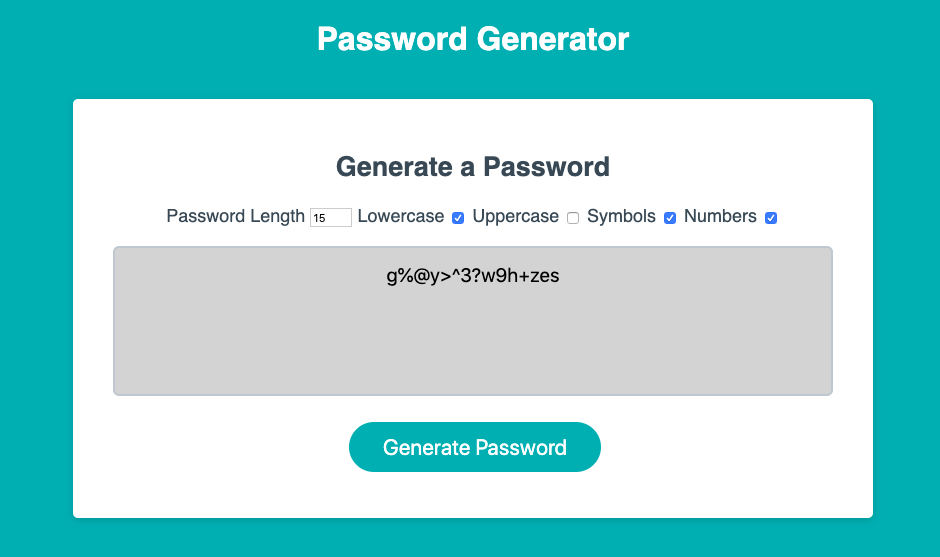

# Password Generator 
## Table of Contents
* [Author(s)](#author(s))
* [Instructions](#instructions)
* [Description](#description)
* [Technologies Used](#technologies-used)
* [Installation](#installation)
* [Usage](#usage)
* [Contributing](#contributing)
* [Deployment Application Link](#deployment-application-link)
* [Application in Use](#application-in-use)

## Author(s)
Joey Bruno

## Instructions 
1. Set your Password Length. You have the options of 8 to 128. 
2. Choose your criteria (uppercase, lowercase, symbols, or numbers in your password).
3. Hit the generate button. 
4. Copy and paste the password given to you in the text area.

## Description
This is a password generator. It includes uppercase, lowercase, number, symbol filters for the password generator when you generate the password.

## Technologies Used
* HTML
* CSS
* Javascript

## Installation
To install this application you clone the SSH Key from the main hub page of this repository and you paste that clone link into your Terminal with git clone.

## Usage
To use this application you go to the deployed link available within this README file.

## Contributing
To contribute, clone this repository into your terminal, work on the project, then create a pull request.

## Screenshot in Use 

## Development Link
[GitHub for Password Generator](https://github.com/brunojoey/password-generator)

## Deployed Link
[Password Generator Link](https://brunojoey.github.io/password-generator/)
